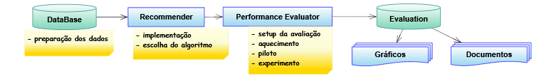

# RSEvaluator (Recommender Systems Evaluator)
 RSE is a framework aimed to accomplish an offline performance evaluation of recommender systems. It tries to hide the complexity of creating an evaluation, so we hope it be useful for developers or appraisers in helping to solve their issues. In addition, one could use part of the framework to build a performance evaluation in other context rather than recommender systems, reusing all the statistical logic and the graphical tools.

## Features

* Comparisons between recommender algorithms
* Parameter adjustment for a single algorithm
* Built-in graphical tools
* Results are presented using mean and variability, so they are interpreted in a statistical point of view
* User requests can be simulated in two modes: normal distribution and peak times
* It was developed in modules aiming to be easily extendable
* 4 implemented recommender algorithms, plus a non personalized one
* 5 factors (input parameters)
* 11 response variables (output metrics) split into five groups: accuracy, decision-support, user-centered, ranking and performance
* 2 evaluation modes: multifactorial and multilevel
* Warmup, replicas for each experiment, cross-fold validation

## Workflow

## Prerequisites

You will need PostgreSQL installed.

## Next updates
* Quickstart guide
* Documentation
