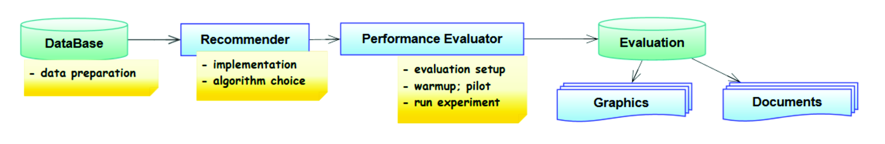

# RSEvaluator (Recommender Systems Evaluator)
 RSE is a framework aimed to accomplish an offline performance evaluation of recommender systems. It tries to hide the complexity of creating an evaluation, so we hope it be useful for developers or appraisers in helping to solve their issues. In addition, one could use part of the framework to build a performance evaluation in other context rather than recommender systems, reusing all the statistical logic and the graphical tools.

## Features

* Comparisons between recommender algorithms
* Parameter adjustment for a single algorithm
* Built-in graphical tools
* Results are presented using mean and variability, so they are interpreted in a statistical point of view
* User requests can be simulated in two modes: normal distribution and peak times
* It was developed in modules aiming to be easily extendable
* 4 implemented recommender algorithms, plus a non personalized one
* 5 factors (input parameters)
* 11 response variables (output metrics) split into five groups: accuracy, decision-support, user-centered, ranking and performance
* 2 evaluation modes: multifactorial and multilevel
* Warmup, replicas for each experiment, cross-fold validation

## Workflow

## Quickstart Guide
1. Install PostgreSQL and configure its access in utils.Config.java (look at label "Part 1")
2. Run RSEvaluator and create an evaluation database (menu option [1])
3. Create your test database (menu option [2]). Change the Config file part 2
4. Import your dataset. We don't have a menu option yet, but you can use the auxiliary functions (importData(), dropConstraint(), addForeignKey()) in database.Groundwork class.
5. This is an offline data processing step. You should change the Config file part 4, and use the following methods to complete some important information inside database:
    * User.splitRatings75(); (75% as history; 25% as test set)
    * User.computeAverageRating(true); 
    * User.computeHistoryAverageRating();
    * Utils.itensAverageRating();
    * Utils.computePopularity();
    * Utils.nonPersonalizedScore();
    * CollaborativeFiltering.UserUserPearsonSimilarity();
    * CollaborativeFiltering.ItemItemPearsonSimilarity();
6. Change the Config file part 6. Run experiments using menu options [3] and [4]
7. After experiments, the results will be stored in the Evaluation database. Use the menu options [5] to [9] to see and interpret them.
 
## Output
After completing the experiments, RSE shows the results as graphs. We believe that this is a more intuitive way to interpret them. Some examples are displayed below:

  
   

  
  
  

## Current Interface

## Class Diagrams

